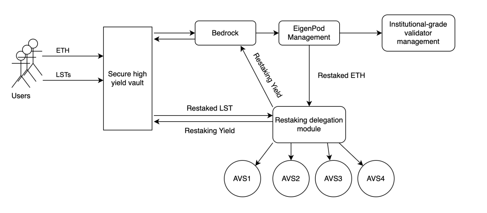

# 🏛️ High-Level Architecture

##

<figure><figcaption>
Bedrock Liquid Restaking architecture
</figcaption></figure>

## Bedrock

* The Bedrock protocol is evolving to a [Liquid Restaking](../introduction/intro-to-liquid-restaking/liquid-restaking-with-eigenlayer.md) system thanks to the EigenLayer protocol&#x20;
* In the near future, Bedrock will be able to accept variant [Liquid Staking Tokens (LST)](../introduction/intro-to-liquid-staking.md) in the market and help the LST holders to earn extra yields without compromising the fund security.

## EigenPod Manager

* EigenPod Manager a.k.a [restaking contract](../../security/smart-contracts/) is that securely manages eigenpod contract automatically, it enables all the asset management like unstake, rewards allocation etc.

## Validator Cluster

* The institutional-grade validator cluster is a sophisticated module to manage Ethereum validators to secure Ethereum blockchain network and earn staking rewards. It’s the barebone of Bedrock system with tracked record since it’s launch in early 2023.

## Restaking Delegation Module

* This module is still under development, and it depends on the AVS module readiness of EigenLayer protocol.
* This module aims to [optimise the strategies ](../../eigenlayer/introduction-to-eigenlayer/restaking/anti-slashing-of-restaking.md)dynamically and maximise the yields, based on the performance of multiple AVS services providers and AVS operators.
