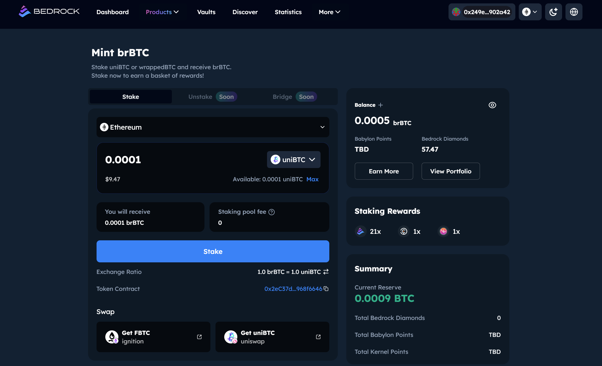

# 🪄 Mint brBTC


Bedrock now accepts [uniBTC](../unibtc/) and multiple wrapped BTC in different networks, to illustrate, [uniBTC](../unibtc/) is used in this tutorial. It always encourage users to go to [brBTC](https://app.bedrock.technology/brbtc) page to check the latest accepted wrapped BTC on different networks.


1. To stake your [uniBTC](../unibtc/) for brBTC in [brBTC](https://app.bedrock.technology/brbtc), click 'Connect Wallet' at the top of the page to link your preferred wallet (MetaMask in this tutorial) to the dApp. Once connected, the mint/withdraw function for brBTC will be available.

<figure><figcaption>
Figure 1: Connect supported wallet
</figcaption></figure>

2. (Optional) Select the network that you have supported BTC assets to stake.

<figure><figcaption>
Figure 2: Select network
</figcaption></figure>

3. Approve the allowance to Bedrock brBTC mint smart contract.

<figure><figcaption>
Figure 3: Grant necessary allowance to Bedrock brBTC contract
</figcaption></figure>

4. Stake your [uniBTC](../unibtc/) to mint brBTC
   1. Enter the amount of uniBTC to stake
   2. Confirm to stake
   3. Confirm(Sign) again in wallet

<figure><figcaption>
Figure 4a: Ready to stake
</figcaption></figure>

<figure><figcaption>
Figure 4b: Confirm to stake
</figcaption></figure>

<figure><figcaption>
Figure 4c: Confirm again in wallet
</figcaption></figure>

5. You will receive brBTC when you deposit it and it will accrue staking rewards over time by growing in token value.

<figure><figcaption>
Figure 5a: Stake in progress
</figcaption></figure>

<figure><figcaption>
Figure 5b: brBTC minting successfully!
</figcaption></figure>

6. (Optional) Add brBTC token into your wallet
   1. To be able to view your brBTC on your Metamask wallet, click 'Add to MetaMask' to import the uniBTC token to MetaMask as example.

<figure><figcaption>
Figure 6a: Add brBTC token to wallet
</figcaption></figure>

\
